# Hints for assignment 2

I said I'd give out hints if you need them, and it seems you do! So here goes

## First

We need to update a material whenever we change a value of an element in the widget that shows up when we get close to an object. I shared a screenshot of how to change a material parameter using blueprints in the day 7 notes.

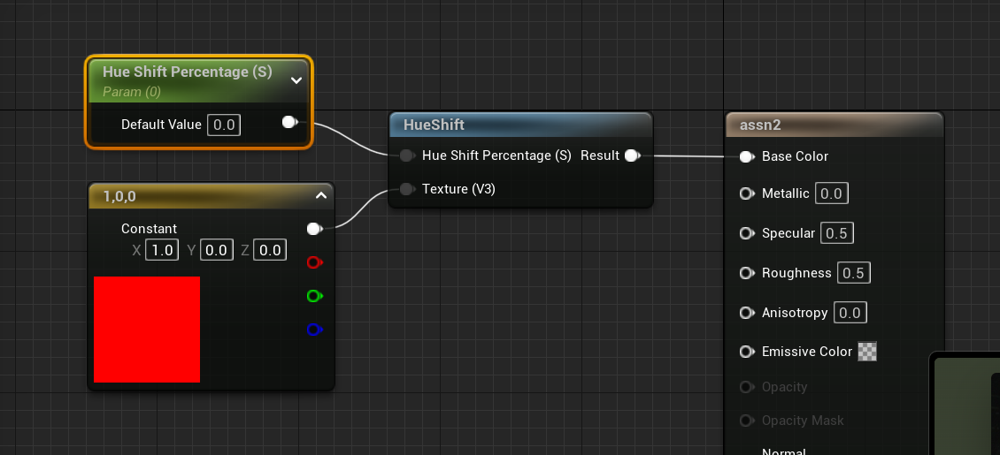

Let's say you've got a material looking like this, I'll change this `Hue Percentage` on runtime.

I'll right-click this material and create a material instance (name it something like `MI_Assn2`).

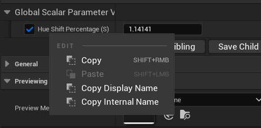

This is the material instance, I'll right-click the parameter to copy its display name (just so we're certain we have the right spelling).

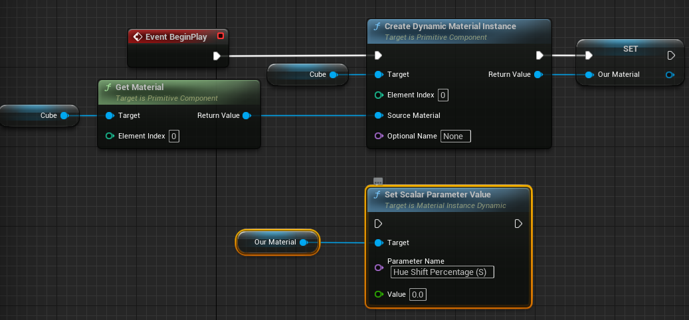

This setup will allow us to change the `Value` of `Hue Shift Percentage (S)` to whatever and whenever it's executed, which brings us to hint number 2.

## Second

I'll use a `CustomEvent` to keep things tidy.

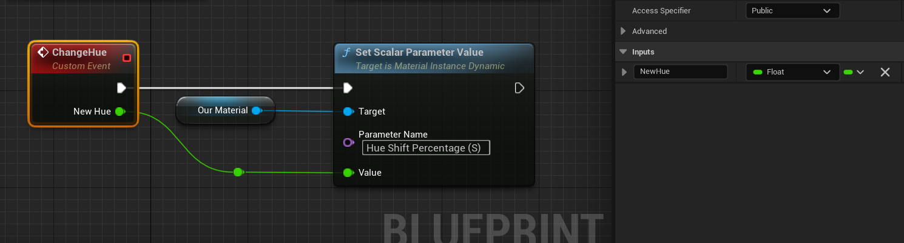

We'll now fire off this custom event whenever the value is changed in the widget (in my case, I'll use a slider).

After adding the `CustomEvent` node, rename it to something appropriate, and in the details panel give it an input, set its type to `float` and rename that too.

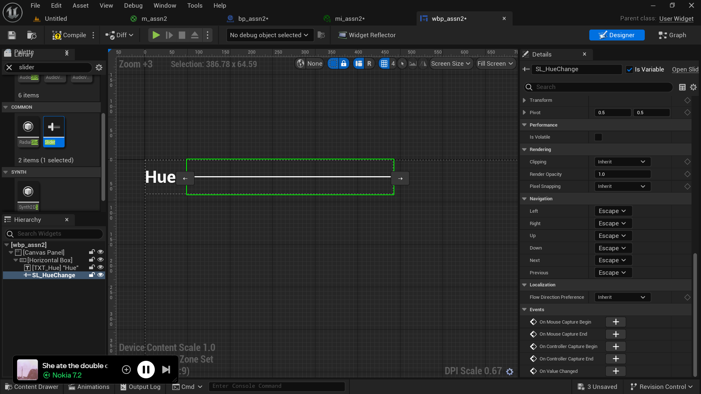

Take a look at this quick widget. Using a `Horizontal Box` to align the text and slider; set the slider to `Is Variable` and scroll down and select the $+$ icon next to the `On Value Changed` event. This'll open up the graph editor with this event.

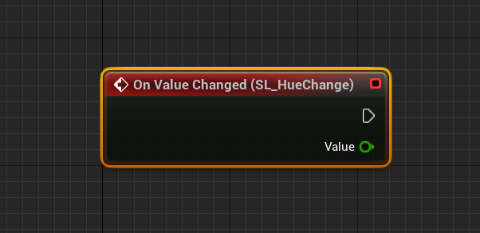

Take a look at this node, this fires off whenever we change the slider, and gives the current/updated value of the slider (exactly what we need, and exactly what we made as a custom event previously). This brings us to hint number 3, blueprint communication.

## Third

We now need to communicate between the Widget Blueprint and the one with our material to be changed. *There are many, many ways to do this, and I'm about to give you pretty much the complete solution to this assignment, proceed with caution.*

A starting point if you don't want the solution but still something:


This is a starting point. As a side-note, let me talk about `tags`.

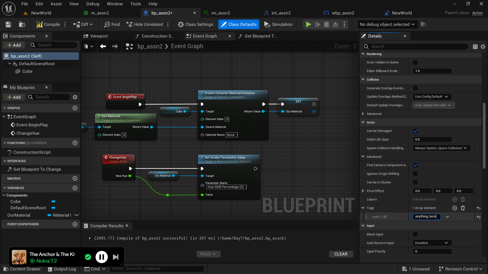

We have now given the *anything-here* tag to this blueprint.

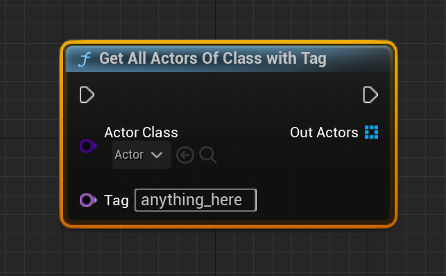

This will give us the list of every blueprint whose parent class is `Actor` (like ours) and has the `anything_here` tag (like we just gave). Since this is a custom tag, we know our blueprint is the only one with it, and hence it'll be the $0^{th}$ (and only) element in the array this node returns. Let's now use this.

### Casting

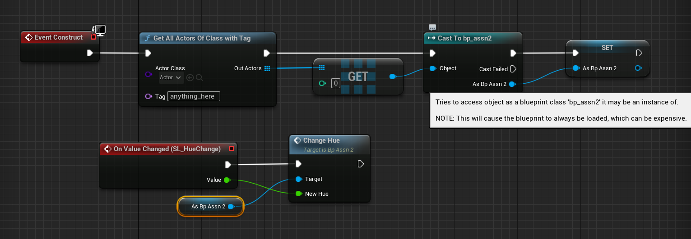

Take a look at this, it works just as you'd want it to. If you're familiar with Java or other statically-type languages, the `Out Actors` is an array of type `Actor` (or, say, `Object` in Java), which we then cast to our custom class (whose name is `bp_assn2`) (like casting a `Object` to a `Int`, this casting will not succeed all the time, but if it does, we get some `Int` specific operations we can perform to our original object).

In this case, we know the casting will work because we know which blueprint we gave our custom tag to, and what *data type* it is. Doing this allows us to now use all the methods and attributes we defined in `bp_assn2`, one of which is the custom event we defined. (Note that you could always do this without custom events, but that'll spread out the material changing code over to the widget blueprint and away from the actual blueprint that contains the material, this is why using custom events are recommended).

## Interfaces

Performing these casting operations is not recommended (take a look at the tooltip hint that shows up when hovering over the cast node). To fix this, we use *Interfaces*.

Create one by right-clicking in the content browser and Blueprint > Blueprint Interface (rename it to `INT_Assn2` since we'll use this to reference `BP_Assn2`).

Open it up, it'll hint at you to rename the `NewFunction` to something else, I renamed my function to `GetAssn2Ref`.

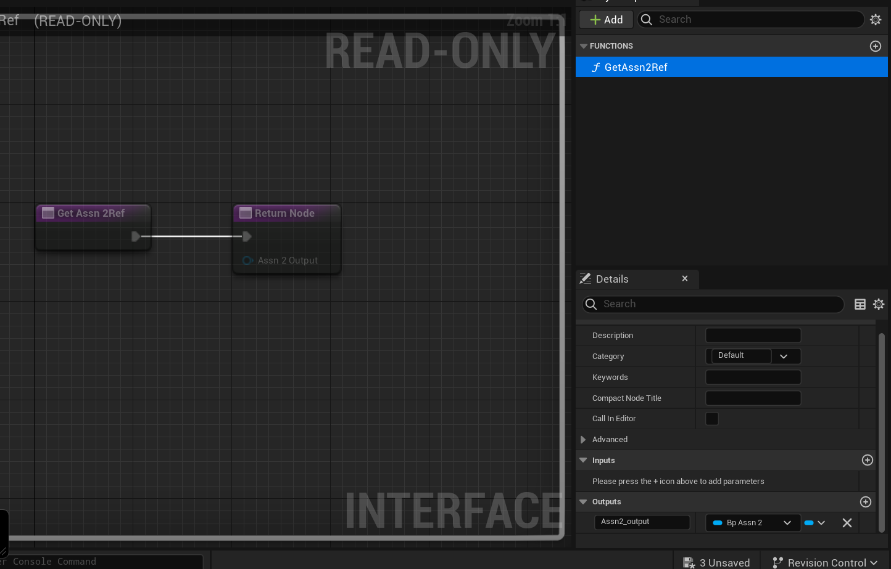

Scroll down and add an output (the $\oplus$ button). Set its type to `BP_Assn2` (if we wanted it to output 5, we'd keep this type to `int`, exactly similar to any statically typed programming language.)

A quick run-through in C:

```c
Point unit = create_point(1, 1)
```

Where `Point` is a struct that looks like

```c
struct Point {
    int x;
    int y;
} typedef Point;
```

and

```c
Point create_point(int x, int y)
{
    Point temp;
    temp.x = x;
    temp.y = y;
    return temp;
}
```

Here, `Point` is our variable type (`BP_Assn2`), `unit` is our variable name (`Assn2_output`) and the `create_point(1, 1)` returns us the actual data. We'll now plug in the actual data to be stored as this variable in our blueprint.

Open up `BP_Assn2` and click on `Class Settings`.

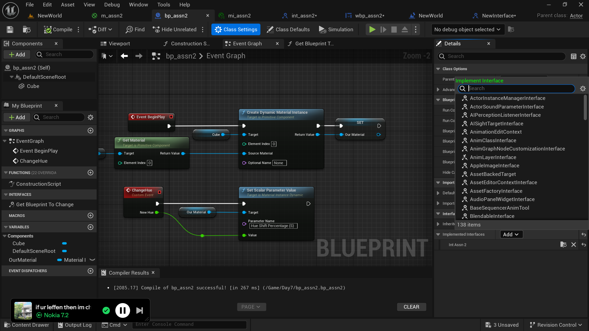

Find the `Implemented Interfaces` dropdown and search for the interface we just made. This will create a new dropdown on the left whose name is `Interfaces`, under which you'll find the function we created. Double click this function to open it up in a new window. (Make sure to compile and save your interface.)

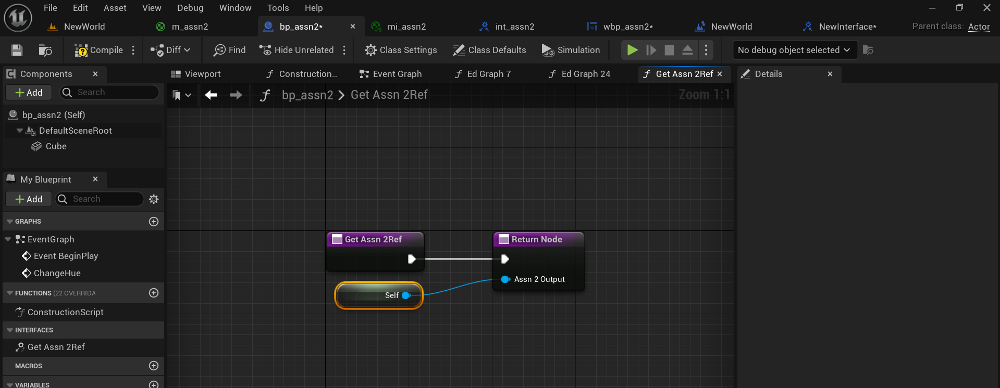

Drag out from `Assn 2 Output` and search for self (exactly similar to `self` in Python, C or `this` in JavaScript). We've now populated this variable with the blueprint we need.

In our widget blueprint editor:
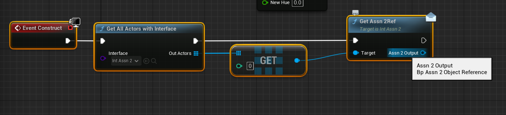

We now have a reference to our blueprint with the material to be changed, and we can drag off of this and call our custom event, just like we did with casting.

## Finish

This was pretty much the entire assignment, now you need to simply figure out some basic overlap events (and, optionally, but a good challenge, figure out how to effectively create duplicates of the blueprint in the viewport and change the material independently). I know I was just going to write some hints, but I hadn't yet explained interfaces, so this turned out to be bigger than I thought, but I hope this makes things clear and why we're doing what we do, if not, as always, hit me up.
